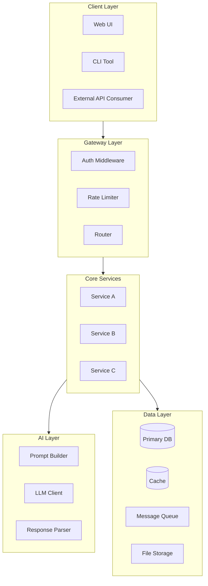
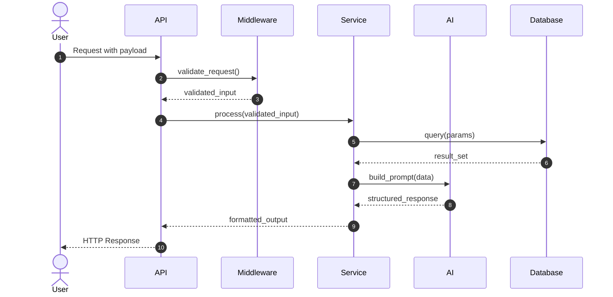
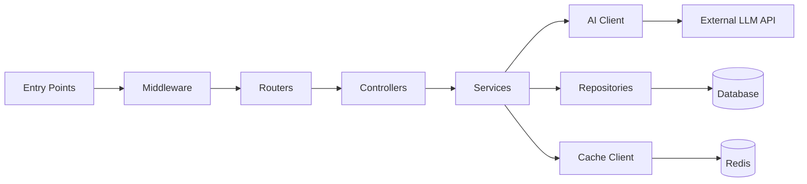
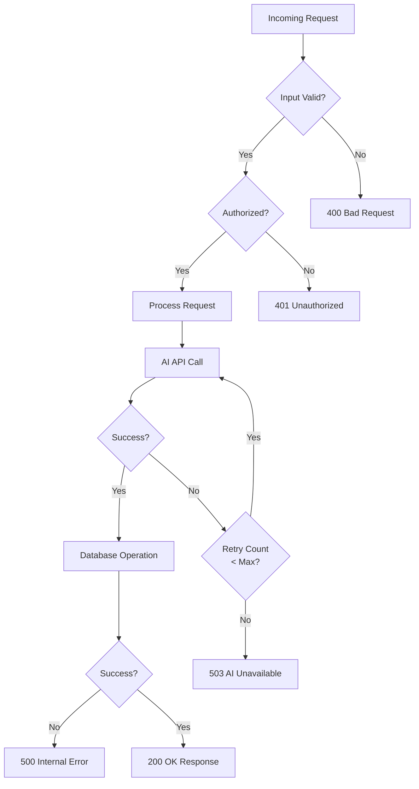
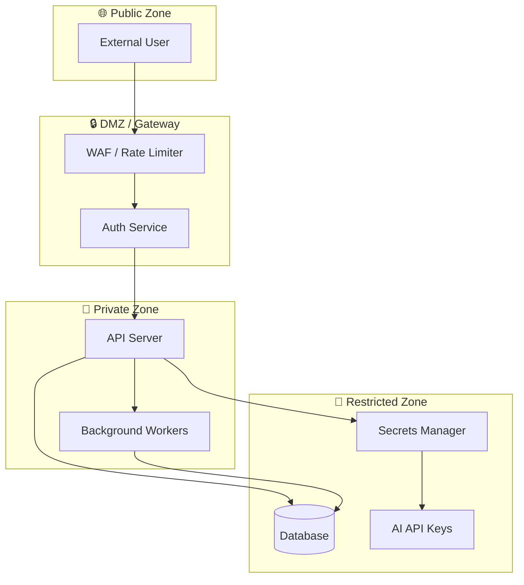

# MASTER REVERSE ENGINEERING & ARCHITECTURE DOCUMENTATION PROMPT
## Version 2.0 — Enhanced, Gap-Corrected, Production-Grade

---

## PURPOSE

This prompt instructs an AI agent to perform **deep, exhaustive reverse engineering** of any codebase — regardless of language, size, or complexity. It produces a complete system-level understanding including architecture diagrams, execution flows, security posture, and actionable improvement recommendations.

**Designed for:**
- New developer onboarding
- Pre-release architecture audits
- AI agent autonomous operation
- Technical debt assessment
- Security review preparation

---

## WHEN TO TRIGGER THIS PROMPT

| Trigger Event | Priority |
|---|---|
| New module or service added | HIGH |
| Major refactoring completed | HIGH |
| Before any production release | CRITICAL |
| Onboarding new developer or AI agent | HIGH |
| Post-incident root cause analysis | CRITICAL |
| Dependency or framework upgrade | MEDIUM |
| Security audit preparation | CRITICAL |
| Performance bottleneck investigation | MEDIUM |

---

---

# ═══════════════════════════════════════════
# MASTER PROMPT — SYSTEM REVERSE ENGINEERING
# ═══════════════════════════════════════════

You are a **Senior Software Architect**, **Security Engineer**, and **Reverse Engineering Expert** with deep expertise across multiple languages, frameworks, and system paradigms.

Your task is to perform a **complete, ground-up reverse engineering** of the provided codebase — as if you received it with zero prior context and must reconstruct every intention, design decision, and execution path the original authors had in mind.

---

## ⚠️ ABSOLUTE RULES (NON-NEGOTIABLE)

```
1. NEVER hallucinate functions, modules, or behaviors not present in the code
2. NEVER skip any file — including configs, dotfiles, lock files, and scripts
3. If something is ambiguous → explicitly state: "AMBIGUOUS: Not explicitly defined in code"
4. If something is missing → explicitly state: "NOT FOUND: Expected but absent"
5. Use EXACT names from code — no paraphrasing of function/class/variable names
6. Do NOT summarize superficially — reconstruct with surgical precision
7. Treat every comment, TODO, FIXME, and HACK annotation as an artifact to document
8. Every diagram MUST reflect actual code — no placeholder examples
```

---

## PHASE 0 — PRE-ANALYSIS: INPUT HANDLING & EXTRACTION

**Before analyzing any code, execute this phase completely.**

### Step 0.1 — Inventory the Input

Scan everything provided:

```
□ List all files by type and path
□ List all directories and their apparent purpose
□ Identify the primary language(s) used (with percentage estimate if mixed)
□ Identify the framework(s) in use
□ Count total files, total lines of code (approximate)
□ Note any binary files, compiled artifacts, or build outputs
```

### Step 0.2 — Archive & Compressed File Handling

**If any `.zip`, `.tar`, `.tar.gz`, `.tgz`, `.rar`, `.7z`, `.gz`, or `.bz2` files are found:**

```
1. STOP and list all archives found with their sizes
2. Extract each archive to a dedicated subdirectory named after the archive
3. After extraction, recursively scan for nested archives and extract those too
4. Re-inventory all files after full extraction
5. Note: if any archive is password-protected → flag as: "LOCKED ARCHIVE: [filename] — requires credentials"
6. If extraction reveals build artifacts (.class, .pyc, __pycache__, node_modules, .git):
   - Document their presence
   - Exclude from primary code analysis BUT note what they imply about the build pipeline
   - DO analyze .git history metadata if accessible (last commits, branches, authors)
7. Cross-reference extracted contents with any manifest files (MANIFEST.MF, package.json, requirements.txt)
   to verify completeness — flag missing expected files
```

### Step 0.3 — Environment & Configuration Discovery

Before touching source code, catalog:

```
□ .env, .env.example, .env.local, .env.production — list all keys (NOT values)
□ config/, settings/, conf/ directories
□ docker-compose.yml, Dockerfile, .dockerignore
□ Kubernetes manifests (.yaml/.yml in k8s/, helm/, deploy/)
□ CI/CD configs (.github/workflows/, .gitlab-ci.yml, Jenkinsfile, .circleci/)
□ Infrastructure-as-code (terraform/, pulumi/, serverless.yml)
□ Build configs (webpack.config.js, vite.config.ts, Makefile, build.gradle, pom.xml)
□ Linting/formatting (.eslintrc, .prettierrc, pyproject.toml, .flake8)
□ Testing configs (jest.config.js, pytest.ini, vitest.config.ts)
```

For each config found, document:
- What it configures
- What external services/systems it implies
- Any hardcoded values (flag as potential security issue)

### Step 0.4 — Dependency Analysis

```
□ Parse ALL package manifests:
  - package.json / package-lock.json / yarn.lock (Node)
  - requirements.txt / Pipfile / pyproject.toml (Python)
  - go.mod / go.sum (Go)
  - Cargo.toml (Rust)
  - pom.xml / build.gradle (Java/Kotlin)
  - Gemfile (Ruby)
  - pubspec.yaml (Dart/Flutter)

□ For each dependency category, list:
  - Production dependencies (runtime)
  - Development dependencies (build/test only)
  - Peer dependencies
  - Pinned vs. floating versions

□ Flag:
  - Outdated major versions (if determinable from context)
  - Dependencies with known CVE patterns (e.g., older lodash, log4j, etc.)
  - Unusual or suspicious packages
  - Packages that duplicate functionality (bloat)
  - Transitive dependency conflicts (if lock file available)
```

---

## PHASE 1 — ARCHITECTURE RECONSTRUCTION

### Section 1: SYSTEM OVERVIEW

Produce a complete, technical description covering:

```
1.1 — Core Purpose
  - What problem does this system solve?
  - Who are the intended users/consumers?
  - What is the system's primary value proposition?

1.2 — Architectural Style
  - Monolith / Microservices / Serverless / Event-Driven / Hybrid?
  - Synchronous / Asynchronous / Both?
  - Client-Server / Peer-to-Peer / Queue-Based?

1.3 — Technology Stack (be exhaustive)
  - Language(s) and version constraints
  - Frameworks and their roles
  - Databases / storage systems (inferred or explicit)
  - Message queues / event buses
  - External APIs and third-party services
  - Authentication/authorization systems
  - Caching layers
  - CDN / static asset delivery

1.4 — Deployment Topology
  - Where does this run? (Cloud provider, on-prem, hybrid)
  - Containerized? What orchestration?
  - Serverless functions? Which provider?
  - Inferred from configs — if not explicit, state "INFERRED from [evidence]"

1.5 — Major Components (name every one)
  - List all top-level modules/services
  - One-line responsibility for each
```

---

### Section 2: ENTRY POINT ANALYSIS

Identify **every** entry point into the system:

```
□ HTTP/REST API routes (list all endpoints with method and path)
□ GraphQL resolvers
□ CLI commands and flags
□ Scheduled jobs / cron tasks
□ Event listeners / message queue consumers
□ WebSocket handlers
□ Background workers
□ gRPC service definitions
□ Lambda/Cloud Function handlers
□ Main() / __main__ / index.js equivalents
□ Test entry points (if test runner is also a system trigger)
```

For each entry point, document:
- Exact file and line where it is defined
- What it accepts as input (type, schema, constraints)
- What authentication/authorization is applied at this layer
- What it calls next

---

### Section 3: COMPLETE EXECUTION FLOW

Trace **every major user journey or system trigger** end-to-end.

For **each flow**, provide:

#### Flow Name: `[e.g., "User File Upload and Analysis"]`

```
Step 1: [Actor] → [Action] → [System Component]
  - Input: [exact data structure]
  - Validation: [what is checked]
  - Output: [what is passed forward]

Step 2: [Component A] → [calls] → [Component B: function_name()]
  - Transformation: [what changes]
  - Side effects: [DB writes, logs, events emitted]
  - Error path: [what happens on failure]

... continue until final output
```

**Include ALL flows found:**
- Happy path
- Error/exception paths
- Timeout/retry paths
- Async/callback paths
- Webhook/callback flows

---

### Section 4: DATA FLOW ANALYSIS

Document how data transforms across the system:

#### 4.1 — Data Lifecycle

```
For each major data entity:
  - Name / type
  - Where it is created (origin)
  - How it is validated and sanitized
  - How it transforms at each stage (show before/after schema)
  - Where it is persisted (DB table, cache key, file)
  - Where it is consumed/read
  - Where it is deleted or expired
  - Who/what has access at each stage
```

#### 4.2 — Schema Documentation

```
For every data model, schema, or type definition found:
  - Field name
  - Type
  - Required/optional
  - Default value
  - Constraints/validators
  - Relationships to other models
```

#### 4.3 — External Data Contracts

```
For each external API consumed:
  - Base URL / service name
  - Endpoints called
  - Request format (headers, body schema)
  - Response format expected
  - Error handling strategy
  - Rate limiting awareness
  - Auth mechanism (API key, OAuth, JWT)
```

---

### Section 5: MODULE-BY-MODULE BREAKDOWN

**For EVERY file in the codebase** (no exceptions):

---

#### File: `[full/path/to/filename.ext]`

| Property | Detail |
|---|---|
| **Language** | |
| **Role** | |
| **Layer** | (e.g., API, Service, Data, Util, Config, Test) |
| **Lines of Code** | |

**Purpose:**
> One precise paragraph explaining what this file does and why it exists.

**Key Exports / Public Interface:**
```
- ClassName or function_name(param: type) → return_type
  Description of behavior
```

**Internal Logic (non-trivial functions):**
```
function_name():
  - Algorithm used
  - Time/space complexity if relevant
  - Edge cases handled
  - Edge cases NOT handled (gaps)
```

**Dependencies (imports):**
```
- What it imports from internal modules
- What it imports from external packages
```

**Side Effects:**
```
- DB reads/writes
- File I/O
- Network calls
- State mutations
- Events emitted
```

**TODOs / FIXMEs / HACs found:**
```
- Line X: [exact comment text] — Risk assessment
```

**Coupling Assessment:**
```
- Tightly coupled to: [list]
- Could be decoupled by: [suggestion]
```

---

### Section 6: FUNCTION CALL GRAPH

Document call relationships:

#### 6.1 — Call Chain Map

```
entrypoint_function()
  └─ calls: service_function(input)
       └─ calls: db.query(sql)
       └─ calls: cache.get(key)
       └─ calls: ai_client.complete(prompt)
            └─ calls: response_parser(raw)
                 └─ calls: validator.check(parsed)
```

#### 6.2 — Critical Path Identification

Identify the **longest** and **most critical** execution chains — these are your performance and fault risk hotspots.

#### 6.3 — Circular Dependency Detection

```
□ Identify any circular imports or circular call dependencies
□ Flag as: "CIRCULAR DEPENDENCY: A → B → C → A"
□ Assess impact and recommend resolution
```

#### 6.4 — Dead Code Detection

```
□ Identify exported functions/classes never imported elsewhere
□ Identify commented-out code blocks
□ Identify unreachable branches (after unconditional return/throw)
□ Flag: "DEAD CODE: [location] — [reason it appears unused]"
```

---

### Section 7: AI / LLM INTEGRATION ANALYSIS

*(Complete this section if AI/LLM calls are present. If absent, state: "NO AI INTEGRATION FOUND.")*

#### 7.1 — Integration Points

```
For each AI call found:
  - File and function where call is made
  - Model/provider used (OpenAI, Anthropic, Cohere, local, etc.)
  - API call type (completion, chat, embedding, image, speech)
  - Context window management strategy
  - Streaming vs. blocking
```

#### 7.2 — Prompt Engineering Audit

```
For each prompt:
  - Where is it defined? (hardcoded, template, database-driven)
  - What dynamic variables are injected?
  - Is user input ever injected directly? (PROMPT INJECTION RISK — flag if yes)
  - What constraints/instructions are applied?
  - System prompt vs. user prompt separation?
  - Is there output format enforcement (JSON mode, structured output)?
```

#### 7.3 — AI Output Handling

```
□ How is AI output parsed?
□ What happens when output is malformed?
□ Is there retry logic? How many attempts?
□ Is there fallback behavior if AI is unavailable?
□ Is AI output sanitized before use/display?
□ Is AI output validated against a schema?
□ Is AI output stored/logged? (privacy implications)
```

#### 7.4 — Cost & Performance Awareness

```
□ Are token counts tracked?
□ Is there prompt caching or memoization?
□ Are there rate limits respected in the code?
□ Are long inputs truncated intelligently?
```

---

### Section 8: ASYNC, CONCURRENCY & STATE MANAGEMENT

```
8.1 — Async Patterns Used
  □ Async/await
  □ Promises / callbacks
  □ Event emitters
  □ Worker threads / child processes
  □ Message queues
  □ Coroutines

8.2 — Race Condition Risk Assessment
  □ Identify shared mutable state
  □ Identify missing locks or semaphores
  □ Identify non-atomic operations on shared resources
  □ Flag: "RACE CONDITION RISK: [location] — [description]"

8.3 — State Management
  □ Where is application state stored?
  □ In-memory only? Persisted? Distributed?
  □ Session management approach
  □ Cache invalidation strategy (if cache exists)
```

---

### Section 9: ERROR HANDLING & RESILIENCE ANALYSIS

```
9.1 — Error Handling Patterns
  □ try/catch coverage — which functions have it, which don't
  □ Global error handlers (process.on('uncaughtException'), Flask error handlers, etc.)
  □ HTTP error response standardization
  □ Logging of errors — what is logged, where

9.2 — Retry & Timeout Logic
  □ Which external calls have retry logic?
  □ What retry strategy? (linear, exponential backoff, circuit breaker)
  □ Which calls have timeout limits?
  □ What calls have NO timeout (risk: infinite hang)

9.3 — Failure Mode Analysis
  □ What happens if the database goes down?
  □ What happens if the AI API is unavailable?
  □ What happens if a queue is full?
  □ What happens if a required env var is missing?
  □ Classify each: GRACEFUL DEGRADATION / HARD CRASH / SILENT FAILURE
```

---

### Section 10: SECURITY ANALYSIS

#### 10.1 — Input Validation & Sanitization

```
□ All user-facing inputs — are they validated? (type, length, format, whitelist)
□ File uploads — MIME type checked? Size limited? Extension validated? 
  Stored safely (not in web root)?
□ SQL/NoSQL queries — parameterized? ORM used? Raw queries? Injection risk?
□ Shell commands — any exec/system calls? User input ever in command? (CRITICAL RISK)
□ XML/HTML parsing — XXE protection? HTML sanitization before render?
□ Path traversal — file paths constructed from user input? (../../../ risk)
```

#### 10.2 — Authentication & Authorization

```
□ Auth mechanism: JWT / Session / API Key / OAuth / mTLS?
□ Token storage: httpOnly cookie / localStorage / header?
□ Token expiry: enforced? Refresh token pattern?
□ Authorization: role-based? Attribute-based? Where enforced?
□ Are auth checks applied consistently, or are some routes unprotected?
□ Password handling: hashed? Which algorithm? Salted?
□ Rate limiting on auth endpoints?
```

#### 10.3 — Secrets & Credentials Management

```
□ Any hardcoded credentials, API keys, or tokens in source code? (CRITICAL — list all)
□ Are secrets loaded from environment variables or a secrets manager?
□ Are secrets ever logged?
□ Are secrets present in any config files committed to the repo?
□ Is .env in .gitignore?
```

#### 10.4 — Data Privacy

```
□ PII data identified (email, phone, name, address, SSN, health data)
□ Is PII encrypted at rest? In transit?
□ Is PII logged anywhere?
□ GDPR/CCPA compliance signals present?
□ Data retention policy implemented?
```

#### 10.5 — Dependency Vulnerabilities

```
□ List any packages known for historical CVEs found in dependencies
□ Note lock file presence (ensures reproducible builds, prevents supply chain drift)
□ Note any packages installed from non-standard registries
```

---

### Section 11: TESTING COVERAGE ANALYSIS

```
11.1 — Test Infrastructure
  □ Testing framework(s) used
  □ Test runner configuration
  □ Code coverage tooling (if configured)
  □ Mocking/stubbing libraries

11.2 — Test Coverage Assessment
  □ Unit tests: which modules have them, which don't
  □ Integration tests: which flows are tested end-to-end
  □ E2E tests: UI/browser automation present?
  □ Contract tests: API contracts tested?
  □ Security tests: any fuzzing or SAST tooling?

11.3 — Critical Gaps
  □ List every module with ZERO test coverage
  □ Flag: "UNTESTED CRITICAL PATH: [module] handles [function] with no tests"

11.4 — Test Quality Signals
  □ Are tests isolated or interdependent?
  □ Are tests deterministic? (no random seeds, no time-dependent logic without mocking)
  □ Do tests assert behavior or just execution (coverage theater)?
```

---

### Section 12: DATABASE & PERSISTENCE ANALYSIS

*(Skip if no persistence layer found — state "NO PERSISTENCE LAYER FOUND")*

```
12.1 — Database Technology
  □ Type: Relational / Document / Key-Value / Graph / Time-series / Vector?
  □ Engine: PostgreSQL / MySQL / MongoDB / Redis / SQLite / etc.
  □ ORM / query builder used?
  □ Connection pooling configured?

12.2 — Schema Documentation
  For each table/collection:
  - Name
  - All fields with types and constraints
  - Indexes defined
  - Foreign key relationships
  - Soft delete pattern used? (deleted_at field)

12.3 — Migration Strategy
  □ Migration tool present? (Alembic, Flyway, Knex, Prisma Migrate)
  □ Migration files in order?
  □ Rollback migrations defined?
  □ Seed data scripts present?

12.4 — Query Analysis
  □ N+1 query risks identified
  □ Missing indexes for common query patterns
  □ Large table scans without pagination
  □ Raw queries without parameterization
```

---

## PHASE 2 — VISUAL DOCUMENTATION (MERMAID DIAGRAMS)

**ALL diagrams must reflect actual code — no placeholder templates.**

### Diagram A: High-Level System Architecture


*(Replace nodes with actual component names from the codebase)*

---

### Diagram B: Request Lifecycle — Sequence Diagram


*(Replace with actual function names and flows)*

---

### Diagram C: Module Dependency Graph


*(Replace with actual module names — add subgraphs for major domains)*

---

### Diagram D: Data Transformation Flow

```mermaid
flowchart LR
    A["Raw Input\n{unvalidated}"]
    B["Validated Input\n{typed, constrained}"]
    C["Normalized Schema\n{standard shape}"]
    D["AI Prompt\n{structured string}"]
    E["AI Response\n{raw text/JSON}"]
    F["Parsed Output\n{typed object}"]
    G["API Response\n{formatted JSON}"]

    A -->|"validate()"| B
    B -->|"normalize()"| C
    C -->|"build_prompt()"| D
    D -->|"llm.call()"| E
    E -->|"parse_response()"| F
    F -->|"format_output()"| G
```



---

### Diagram E: Error Handling Flow



---

### Diagram F: Security Boundary Map



---

## PHASE 3 — EVALUATION & RECOMMENDATIONS

### Section 13: ARCHITECTURE EVALUATION

#### 13.1 — Strengths

List genuine architectural strengths found in the code (minimum 3, maximum 10). Be specific — cite actual patterns and files.

```
✅ [Strength]: [Specific evidence from code]
```

#### 13.2 — Weaknesses & Technical Debt

```
⚠️ [Weakness]: [Specific location] — [Impact] — [Severity: LOW/MEDIUM/HIGH/CRITICAL]
```

#### 13.3 — Scalability Assessment

```
□ What is the estimated load this architecture can handle before breaking?
□ What is the first component to become a bottleneck under load?
□ Is horizontal scaling possible? What blocks it?
□ Is there a single point of failure? Where?
□ Are stateful components that could prevent scaling identified?
```

#### 13.4 — Maintainability Score

Rate each dimension (1–5) with justification:

| Dimension | Score | Justification |
|---|---|---|
| Code readability | /5 | |
| Separation of concerns | /5 | |
| Test coverage | /5 | |
| Documentation quality | /5 | |
| Dependency management | /5 | |
| Error handling consistency | /5 | |

---

### Section 14: IMPROVEMENT RECOMMENDATIONS

Prioritize by impact and effort:

#### 🔴 CRITICAL (Fix Immediately)

```
[REC-001] Title
  Problem: [exact issue]
  Location: [file:line]
  Risk: [what goes wrong if not fixed]
  Fix: [specific, actionable solution]
  Effort: [hours/days]
```

#### 🟠 HIGH (Fix in Next Sprint)

```
[REC-002] ...
```

#### 🟡 MEDIUM (Backlog Priority)

```
[REC-003] ...
```

#### 🟢 LOW (Nice to Have)

```
[REC-004] ...
```

---

### Section 15: ONBOARDING QUICK-START GUIDE

Generate a guide that lets a new developer run and understand this system in under 30 minutes:

```
## Getting Started

### Prerequisites
[List exact tools, versions, and credentials needed]

### Setup Steps
1. [Exact command]
2. [Exact command]
3. ...

### Running the System
[Exact command to start development server/service]

### Running Tests
[Exact command]

### Key Files to Read First
1. [file] — because [reason]
2. [file] — because [reason]
3. ...

### Common Pitfalls
- [Pitfall 1]: [How to avoid]
- [Pitfall 2]: [How to avoid]

### How to Make a Change
[Step-by-step workflow from code to deployed]
```

---

### Section 16: AI AGENT OPERATION MANIFEST

*(For AI agents operating this system autonomously)*

```yaml
system_manifest:
  name: "[System Name]"
  version: "[inferred from package.json or tag]"
  entry_points:
    - type: http_api
      base_url: "[from config]"
      auth_required: true/false
      auth_type: "[JWT/API_KEY/etc]"
  
  critical_operations:
    - name: "[operation name]"
      trigger: "[how to invoke]"
      expected_input: "[schema]"
      expected_output: "[schema]"
      failure_modes: ["[mode1]", "[mode2]"]
  
  environment_requirements:
    required_env_vars: ["VAR1", "VAR2"]
    optional_env_vars: ["VAR3"]
    external_services: ["service1", "service2"]
  
  health_check:
    endpoint: "[/health or equivalent]"
    expected_response: "[200 OK / schema]"
  
  known_failure_modes:
    - condition: "[trigger]"
      symptom: "[what you observe]"
      resolution: "[exact steps]"
```

---

## FINAL CHECKLIST BEFORE SUBMITTING OUTPUT

```
□ All sections completed (none skipped)
□ All archives extracted and analyzed
□ Every file documented in Section 5
□ All Mermaid diagrams use actual code names (no placeholders)
□ All security risks explicitly flagged
□ All dead code identified
□ All ambiguities explicitly marked "AMBIGUOUS:" or "NOT FOUND:"
□ Onboarding guide is actionable (copy-paste commands work)
□ AI Agent manifest is complete and accurate
□ Recommendations are prioritized and specific
□ No hallucinated components or behaviors
```

---

*END OF MASTER REVERSE ENGINEERING PROMPT v2.0*

---

## CHANGELOG FROM v1.0

| Addition | Why Added |
|---|---|
| Phase 0: Input Handling | Critical gap — v1 had no archive/ZIP handling |
| ZIP/archive extraction protocol | Explicit gap in v1 |
| Dependency analysis | v1 ignored package manifests entirely |
| Config & environment discovery | v1 skipped .env, CI/CD, IaC files |
| Async/concurrency section | v1 had no async pattern analysis |
| Error handling & resilience section | v1 had no failure mode analysis |
| Testing coverage section | v1 completely absent |
| Database/persistence section | v1 completely absent |
| Dead code detection | v1 completely absent |
| Circular dependency detection | v1 completely absent |
| Diagram F: Security Boundary Map | New diagram added |
| Diagram E: Error Flow | New diagram added |
| AI prompt injection risk | v1 had no prompt injection flag |
| Maintainability scoring table | v1 had no structured evaluation |
| AI Agent Operation Manifest | New — enables autonomous AI operation |
| Onboarding Quick-Start Guide | v1 had no developer quickstart |
| Final checklist | Ensures completeness before submission |
